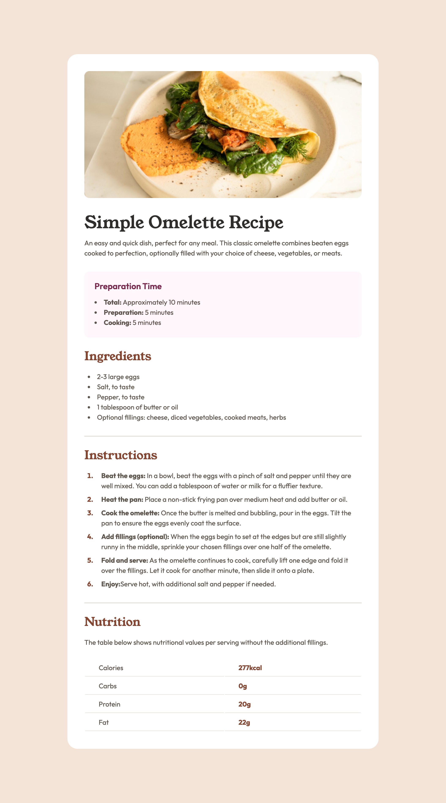
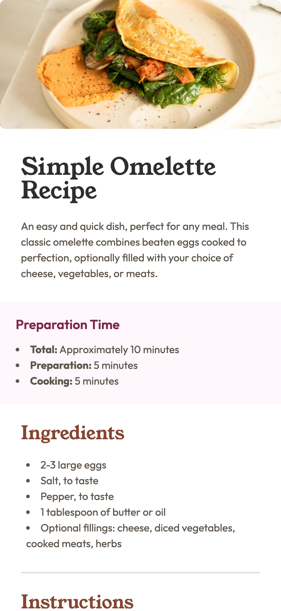

# Frontend Mentor - Recipe page solution

This is a solution to the [Recipe page challenge on Frontend Mentor](https://www.frontendmentor.io/challenges/recipe-page-KiTsR8QQKm). Frontend Mentor challenges help you improve your coding skills by building realistic projects.

## Table of contents

- [Overview](#overview)
  - [The challenge](#the-challenge)
  - [Screenshot](#screenshot)
  - [Links](#links)
- [My process](#my-process)
  - [Built with](#built-with)
  - [What I learned](#what-i-learned)
  - [Continued development](#continued-development)
  - [Useful resources](#useful-resources)
- [Author](#author)
- [Acknowledgments](#acknowledgments)

## Overview

### Screenshot

 
 

### Links

- Solution URL: [Add solution URL here](https://your-solution-url.com)
- Live Site URL: [Add live site URL here](https://your-live-site-url.com)

## My process

### Built with

- Semantic HTML5 markup
- CSS custom properties
- Flexbox
- CSS Grid
- Mobile-first workflow

### What I learned

During the development of this project, I improved my understanding of responsive design and the importance of a mobile-first workflow. I used CSS custom properties to maintain a consistent design system and flexbox for the layout, which allowed me to manage the content effectively across different screen sizes.

A key challenge I overcame was ensuring that images and text adjusted seamlessly without requiring horizontal scrolling on smaller screens.

### Continued development

Moving forward, I aim to dive deeper into CSS Grid and explore more advanced responsive design techniques.

### Useful resources

- [A Complete Guide to Flexbox](https://css-tricks.com/snippets/css/a-guide-to-flexbox/) - This guide helped me understand how to properly utilize flexbox for layout, especially in a mobile-first context.

## Author

- Frontend Mentor - [margaux-works](https://www.frontendmentor.io/profile/margaux-works)
- GitHub - [margaux-works](https://github.com/margaux-works)

## Acknowledgments

I’d like to thank the Frontend Mentor community for their support and feedback throughout this project.
